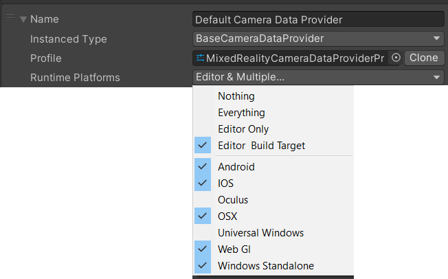

# Mixed Reality Toolkit (XRTK) Frequently Asked Questions


## 1. Can I use the new Unity XR Management System?

The XRTK is meant to be a replacement to the Unity XR Management system, and it is advised not to mix and match the two.

Currently the Magic Leap platform requires the Magic Leap XR Plugin to actually make builds for the platform, the intention is to be fully independent of the Unity XR Management System in the future.

## 2. How do I create a new Mixed Reality Toolkit Project?

We recommend walking through the [Getting Started Guide](../00-GettingStarted.md) for a detailed understanding to get up and running.

However, here is the TL;DR short version:

1. Create a new Unity Project
2. Setup the Legacy XR settings in "Edit -> Project Settings -> Player -> XR Settings" for your current and any other platforms you want to run on
3. Add the XRTK UPM registry to Unity by Opening the Unity Package Manager (`Window -> Package manager`), selecting the `Advanced` drop down and clicking on `Advanced Project Settings`, then Adding the following details:

    > Name: XRTK
    >
    > URL: http://upm.xrtk.io:4873
    >
    > Scope(s): com.xrtk

4. Return to the Unity Package manager and select `My Registries` in the Sources) dropdown (next to the `+` symbol)
5. Select the XRTK.SDK and click Install
6. Close the Unity Package Manager and return to your scene
7. Select or create the scene you want to create Mixed Reality Content in
8. Select `Mixed Reality Toolkit -> Configure` in the Unity Menu. THis will update your scene and add the MixedRealityToolkit instance.
9. Done, you can now run your project for Windows Standalone
10. If you wish, you can install additional platforms, such as Oculus or Windows Mixed Reality from the Package Manager. once installed they will prompt to install their platform configuration in to your project (ENSURE that you have your Mixed Reality Scene open)
11. Provided you have configured the Legacy XR settings for each platform correctly, the project will run

## 3. What do I need to configure to make my Mixed Reality Project run?

In short NONE, Once you import the default configuration, then the project will be available to run on any of the supported platforms, the only exceptions are:

* For Quest on Android, you will also need to install an Android Manifest in to your project using `Mixed Reality Toolkit -> Tools -> Oculus -> Create Oculus Quest compatible AndroidManifest.xml` in the Editor menu to ensure the Android build properly targets the Quest.
* For Magic Leap, you will need to install the ML assets/XR package and follow Magic Leaps instructions for setting up the device.  You will also need an AndroidManifest.xml file for the Magic Leap.

## 4. Do I need to have all systems enabled in my Mixed Reality Toolkit configuration to run?

The only systems which are Mandatory are the `Camera System` and the `Input System`.  All other systems can be safely disabled if you wish and only enabled when you need them.

## 5. I Configured my Mixed Reality Scene, but I do not have a `MixedRealityPlayspace` object.

The Playspace is dynamically updated during edit/run time to meet the needs of the platform it is running on by the Camera system.  If it is not being updated, check your `Camera Settings` are configured for your current platform.  There must be a Camera System configured for the current Runtime platform and/Or the editor.

The Default Camera system installed with the SDK should cover Windows Standalone and most other platforms, however check that its `Runtime Platforms` is configured correctly (and is present)



Other platforms will install their own Camera Systems as required.

## 6. I cannot click on my object in the scene.

For any object to he `Interactable` in a Mixed Reality scene, it must:

* Have been registered with the `InputSystem` as a tracked object using
    ```csharp
        MixedRealityToolkit.InputSystem.Register(gameObject);
    ```
    The XRTK provides a handy base class called `BaseInputHandler` for tracked scene objects
* Have a collider component added and configured relative to the objects dimensions.
    If you are using `Physics Layers`, then ensure the layers used for your objects match those in the Input System configuration

## 7. WHen I interact with an object all my scripts are firing, but I only want one to.

The Input System events have a concept called `Used`, this allows for scenarios where you want multiple scripts to receive an event and control when the chain of events to end. If you want any object to stop and event from propagating then you simply need to handle the `Used` property.

> You should also check if an event is already used in your scripts before executing them.

Here is a sample script:

```csharp
    public class MyEventScript : BaseInputHandler, IMixedRealityInputHandler
    {
        [SerializeField]
        private MixedRealityInputAction myAction = MixedRealityInputAction.None;

        public void OnInputDown(InputEventData eventData)
        {
            if (eventData.used)
            {
                return;
            }

            if (eventData.MixedRealityInputAction.Id == myAction.Id)
            {
                // Do something cool as the user pressed a button on this object
                eventData.used = true;
            }
        }
    }
```

In this script we use the `BaseInputHandler` to register the object in the scene and the `IMixedRealityInputHandler` to listen for Input Events.  When an `InputDown` event is received:

* We check if the event has already been used by another script
* We check if the Input Action configured for this script has been detected by the event
* If the action we were expecting happens and the event hasn't been used already, we perform something and then update the `Used` property of the event to `True` to stop other scripts using.

This patten is very useful if you have multiple scripts attached to an object which perform different things based on the status of the object but only want ONE to work at a time.
The inverse is also true, if you skip checking for `Used` you can have things run regardless.
