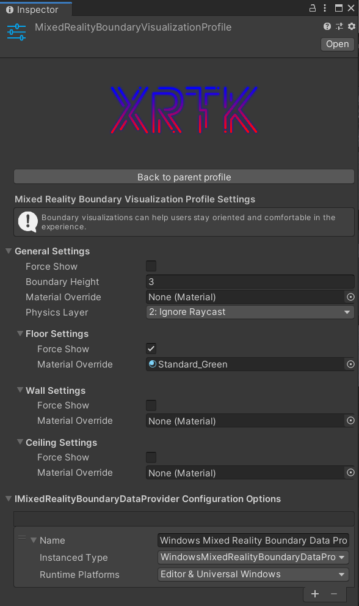

# The Boundary System

The boundary system provides a solution specific boundary implementation for use in your projects, this takes a feed from the vendor supplied data for the boundary and allows you to apply custom textures / details for your project.

## Mixed Reality Root configuration system

In the Root configuration, the specific implementation for the boundary system is selected, which defaults to the XRTK implementation for the boundary system.  In most cases this does not need to be touched, however, advanced users can replace it with their own system if they wish.

## Boundary System platform configuration

The Boundary system for the XRTK allows for different implementations to be utilized for different runtime or build platforms. Where an interface in to the Vendor implementation for a boundary exists, the XRTK will provide an adapter/provider, however, not all platforms do.
Where a boundary provider is available, you can customize how the XRTK manages the boundary area as you wish:

The configuration holds:

* Display settings - Options to show the boundary (or not), as well as its height, physics layer and default material.
* Floor settings - Options to show the floor (or not), as well as the material to be used for the floor.
* Wall settings - Options to show the boundary walls (or not), as well as the material to be used for the walls.
* Ceiling settings - Options to show the ceiling (or not), as well as the material to be used for the ceiling.

## Further notes

For the most part, you should not need to alter the boundary system configuration unless required.  If you wish, you could implement a custom boundary provider to customize the boundary experience or have an artificial boundary.

---

### [**Raise an Information Request**](https://github.com/XRTK/XRTK-Core/issues/new?assignees=&labels=question&template=request_for_information.md&title=)

If there is anything not mentioned in this document or you simply want to know more, raise an [RFI (Request for Information) request here](https://github.com/XRTK/XRTK-Core/issues/new?assignees=&labels=question&template=request_for_information.md&title=).
